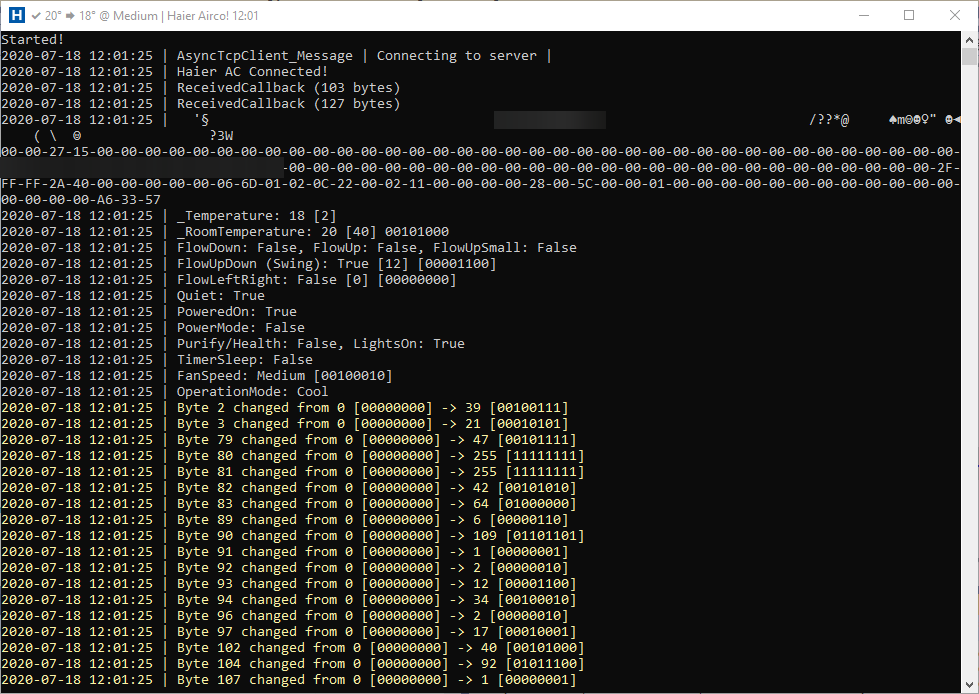

# HaierAC
Haier Aircoditioning Logger is added to GitHub for contributors to get to know how the new (?) Haier AC firmware protocol works.

Hardware used:
* Unit: Haier Tundra 2.0 Single-split Airconditioning set - 5,0 kW
* Wifi: Official Haier USB Wi-Fi module (KZW-W002, Firmware R_1.0.00/e_2.3.12)

## Currently

* Trying to understand the unknown bytes (104, humidity?) and 107, I added some values in the source
* Trying to control it, but it disconnects immediately when I try, so must be something with checksum, or my C# socket implementation

## Getting Started

1. When started for the first time, this tool will scan your local network (only last number 1.2.3.x) for devices listening to port 56800. (So you need to have it connected to WiFi with the official app first)
2. Fill in the correct airco IP and MAC Address (currently not used)
3. Restart tool

It will now begin to log all changes to screen, and Haier.log, and already shows what it understands.

The reason for the tool is getting to know the data structure and protocol so we can control it ourselfves with the official app or remote control, but from Home Assistant.

Most code is in the Program.cs, and the data structure is in `public struct HaierResponse`

## Known Issues

* Network Scanner will only work on Windows, alternatively you can check the IP/mac on the router
* It does NOT control anything (yet :P)
* Some things of the data structure is unknown, but hopefully all what is displayed is correct, please verify!
* It loses the connection EVERY 15 seconds, looks like it might be some ReceiveTimeout, but cannot get it working, if you can, please help! :) Also might be that we need a keepalive command every 10 seconds or so to let the airco know we are still listening. In this file there is a 'polling' command every ~5 seconds: https://github.com/instalator/Haier_WiFi/blob/master/mqtt_esp8266_haier.ino

If you can help in any way, even just let it run and gather state changes could be of help. This way we can get all the possibilities.

## Screenshot

## Other resources

* https://github.com/instalator/Haier_WiFi/ (Blog: https://blog.instalator.ru/archives/433)
  https://github.com/instalator/Haier_WiFi/blob/master/mqtt_esp8266_haier.ino
* https://github.com/bstuff/haier-ac-remote
* https://community.home-assistant.io/t/haier-ac-integration/193002
* https://community.home-assistant.io/t/haier-air-conditioner/25468
* https://community.home-assistant.io/t/esp-haier-haier-air-conditioner-esp-home-wemos-d1-mini/127880
